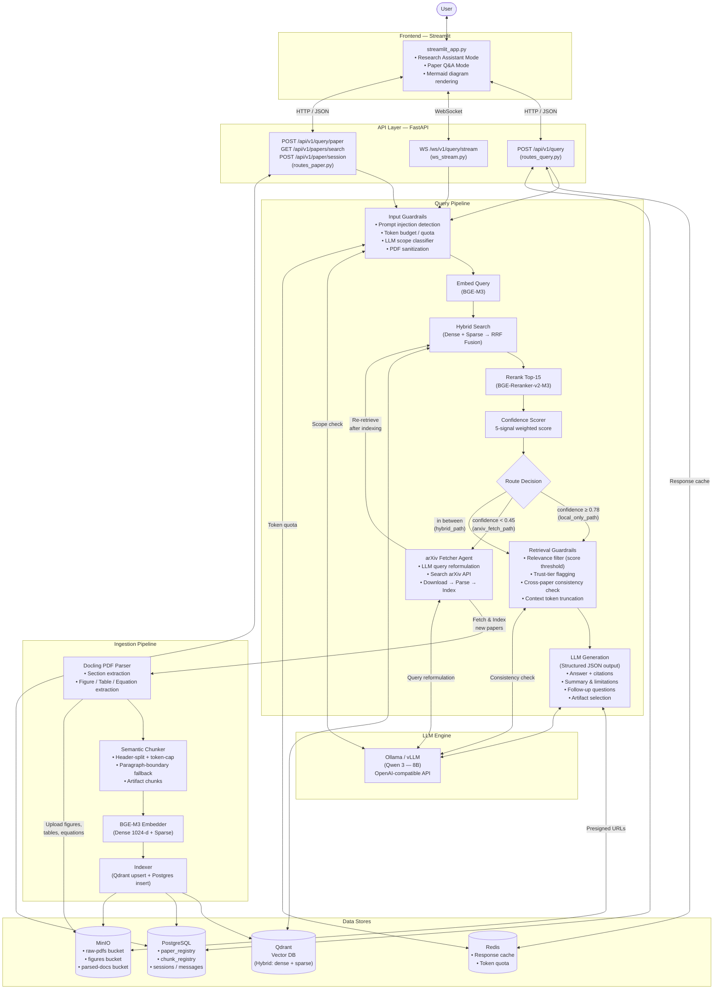

# 📄 ResearchMind-AI

An **Agentic Hybrid-RAG** system for Computer Science research. Ask questions across a corpus of research papers — the system retrieves evidence, scores its confidence, and when local knowledge is insufficient, autonomously fetches and indexes new papers from arXiv in real-time.

---

## Architecture



---

## Project Structure

```
rag-research-chatbot/
├── app/
│   ├── main.py                     # FastAPI entrypoint
│   ├── config.py                   # Pydantic settings (loads .env)
│   ├── query_pipeline.py           # Research Assistant query pipeline
│   ├── paper_query_pipeline.py     # Paper Q&A query pipeline
│   │
│   ├── api/                        # API layer
│   │   ├── routes_query.py         # POST /api/v1/query
│   │   ├── routes_paper.py         # Paper search, session, and query endpoints
│   │   ├── ws_stream.py            # WebSocket streaming endpoint
│   │   ├── schemas.py              # Pydantic request/response models
│   │   └── schemas_paper.py        # Paper-mode specific schemas
│   │
│   ├── ingestion/                  # Document processing pipeline
│   │   ├── parser_docling.py       # PDF → structured sections + artifacts (Docling)
│   │   ├── chunker.py              # Sections → token-capped chunks
│   │   ├── embedder.py             # Text → dense + sparse vectors (BGE-M3)
│   │   ├── indexer.py              # Chunks → Qdrant + Postgres
│   │   ├── metadata_loader.py      # Load paper metadata from JSON
│   │   └── schemas.py              # ParsedDocument, Chunk dataclasses
│   │
│   ├── retrieval/                  # Search and ranking
│   │   ├── qdrant_client.py        # Hybrid search (dense + sparse, RRF fusion)
│   │   └── reranker.py             # Cross-encoder reranking (BGE-Reranker-v2-M3)
│   │
│   ├── generation/                 # LLM response generation
│   │   ├── llm_client.py           # OpenAI-compatible client (Ollama/vLLM)
│   │   ├── context_assembler.py    # Build context + user message for the LLM
│   │   └── prompts.py              # System prompts (research mode, paper mode, grader)
│   │
│   ├── agent/                      # Agentic components
│   │   ├── arxiv_fetcher.py        # Search → download → index from arXiv
│   │   ├── confidence_scorer.py    # 5-signal weighted confidence score
│   │   ├── router_graph.py         # LangGraph-style agentic router
│   │   └── diagram_intent.py       # Detect if user wants a visual diagram
│   │
│   ├── guardrails/                 # Safety and quality filters
│   │   ├── input_guardrails.py     # Injection, token budget, scope, PDF sanitization
│   │   └── retrieval_guardrails.py # Relevance, trust, consistency, truncation
│   │
│   ├── db/                         # Database layer
│   │   ├── models.py               # SQLAlchemy models (paper_registry, chunk_registry, etc.)
│   │   ├── postgres.py             # Engine + session factory
│   │   └── migrations/             # Alembic migrations
│   │
│   ├── services/                   # Business logic services
│   │   └── paper_service.py        # Paper search + session creation
│   │
│   └── utils/                      # Shared utilities
│       ├── cache.py                # Redis-backed response cache
│       ├── redis_client.py         # Redis client + token quota
│       └── minio_client.py         # MinIO (S3) upload, presigned URLs
│
├── frontend/
│   └── streamlit_app.py            # Streamlit chat UI (two modes)
│
├── scripts/
│   └── bulk_ingest_dataset.py      # One-time bulk PDF ingestion with metadata
│
├── docker-compose.yml              # PostgreSQL, Qdrant, Redis, MinIO
├── alembic.ini                     # Alembic migration config
├── requirements.txt                # Python dependencies
├── .env.example                    # Environment variable template
└── wipe_dbs.py                     # Reset Postgres + Qdrant (dev utility)
```

---

## Key Components

### Two Chat Modes

| Mode | Description |
|---|---|
| **Research Assistant** | Queries across the entire paper corpus. Uses confidence-based routing to decide whether to answer from local data or fetch new papers from arXiv. |
| **Paper Q&A** | Queries are scoped to a single selected paper. No arXiv fetching — answers come strictly from that paper's indexed chunks. |

### Ingestion Pipeline

1. **Docling Parser** — Converts PDFs into structured sections. Extracts figures (as PNG → MinIO), tables (as Markdown → MinIO), and equations (as LaTeX → MinIO).
2. **Semantic Chunker** — Splits sections at header boundaries, with a 700-token cap. Oversized sections are split at paragraph boundaries, then at sentence boundaries as a last resort.
3. **BGE-M3 Embedder** — Produces both a 1024-dim dense vector and a sparse (lexical-weight) vector per chunk in one call.
4. **Indexer** — Upserts vector points into Qdrant (named vectors: `dense` + `sparse`) and mirrors chunk metadata into PostgreSQL's `chunk_registry`.

### Query Pipeline

1. **Input Guardrails** — Regex-based prompt injection detection, per-query token cap (500 tokens), Redis-backed per-session token quota (10,000 tokens/hour), LLM-based scope classifier (academic/technical vs. out-of-scope), and PDF sanitization (strips embedded JS).
2. **Hybrid Search** — Embeds the query with BGE-M3, runs two Qdrant prefetch queries (dense cosine + sparse), fuses results with Reciprocal Rank Fusion (RRF).
3. **Reranking** — Top 15 fused candidates are reranked with a cross-encoder (BGE-Reranker-v2-M3), returning the top 10.
4. **Confidence Scoring** — A weighted score from 5 signals: top-1 reranker score (40%), score margin (20%), coverage (20%), recency (10%), distinct sources (10%).
5. **Agentic Routing** — Score ≥ 0.78 → answer from local data. Score < 0.45 → fetch from arXiv first. In between → hybrid (answer with what we have).
6. **arXiv Fetcher Agent** — Reformulates the query via LLM, searches arXiv API, downloads PDFs, runs the full ingestion pipeline, then re-retrieves.
7. **Retrieval Guardrails** — Relevance score threshold (0.35), trust-tier flagging (unverified sources), LLM-based cross-paper consistency check, context token truncation (4,000 tokens max).
8. **Generation** — Sends assembled context + conversation history to the LLM (Qwen 3 via Ollama). Uses Pydantic structured output parsing. Produces answer, summary, limitations, follow-up questions, artifact selection, and confidence explanation. Supports Mermaid diagram generation when visual intent is detected.

### Caching

Successful responses are cached in Redis (SHA-256 hash of normalized query → serialized `QueryResponse`). Cache is bypassed when conversation history exists (multi-turn queries should always be fresh).

---

## Tech Stack

| Layer | Technology |
|---|---|
| Frontend | Streamlit |
| Backend API | FastAPI (REST + WebSocket) |
| LLM | Qwen 3 (8B) via Ollama (OpenAI-compatible API) |
| Embeddings | BAAI/bge-m3 (FlagEmbedding) |
| Reranker | BAAI/bge-reranker-v2-m3 (FlagEmbedding) |
| Vector DB | Qdrant (hybrid dense + sparse search) |
| Relational DB | PostgreSQL 16 |
| Object Storage | MinIO (S3-compatible) |
| Cache / Rate Limiting | Redis 7 |
| PDF Parsing | Docling |
| Migrations | Alembic |
| Containerization | Docker Compose |

---

## Getting Started

### Prerequisites
- Python 3.11+
- Docker & Docker Compose
- [Ollama](https://ollama.ai) installed with a Qwen model pulled (`ollama pull qwen2.5:7b-instruct-q4_K_M`)

### 1. Clone & Configure

```bash
git clone <repo-url>
cd rag-research-chatbot
cp .env.example .env
# Edit .env with your preferred credentials
```

### 2. Start Infrastructure

```bash
docker-compose up -d
```

This starts **PostgreSQL** (port 5431), **Qdrant** (port 6333), **Redis** (port 6379), and **MinIO** (ports 9000/9001).

### 3. Install Dependencies

```bash
python -m venv venv
source venv/bin/activate
pip install -r requirements.txt
```

### 4. Run Database Migrations

```bash
alembic upgrade head
```

### 5. Ingest Papers (Optional)

Place PDFs in `local_dataset/pdfs/` and matching metadata JSON files in `local_dataset/metadata/`, then run:

```bash
python -m scripts.bulk_ingest_dataset
```

### 6. Start the Backend

```bash
uvicorn app.main:app --reload
```

### 7. Start the Frontend

```bash
streamlit run frontend/streamlit_app.py
```

---

## API Endpoints

| Method | Endpoint | Description |
|---|---|---|
| `POST` | `/api/v1/query` | Submit a research query (full pipeline) |
| `WS` | `/ws/v1/query/stream` | Streaming query via WebSocket |
| `GET` | `/api/v1/papers/search?q=...` | Search the paper catalogue |
| `POST` | `/api/v1/paper/session` | Create a Paper Q&A session |
| `POST` | `/api/v1/query/paper` | Query a specific paper |
| `GET` | `/health` | Health check |

---

## Environment Variables

See [`.env.example`](.env.example) for the full list. Key variables:

| Variable | Description |
|---|---|
| `LLM_BASE_URL` | Ollama / vLLM endpoint (e.g., `http://localhost:11434/v1`) |
| `LLM_MODEL_NAME` | Model identifier (e.g., `qwen2.5:7b-instruct-q4_K_M`) |
| `TAU_HIGH` / `TAU_LOW` | Confidence routing thresholds (default: 0.85 / 0.45) |
| `QDRANT_COLLECTION_NAME` | Qdrant collection name (default: `cs_papers`) |
| `REDIS_CACHE_TTL` | Cache TTL in seconds (default: 3600) |
| `CHAT_HISTORY_LIMIT` | Max conversation turns to include (default: 6) |

---

## Utility Scripts

| Script | Purpose |
|---|---|
| `scripts/bulk_ingest_dataset.py` | Bulk-ingest a local PDF corpus with metadata |
| `wipe_dbs.py` | Clear all data from PostgreSQL and Qdrant (dev only) |
